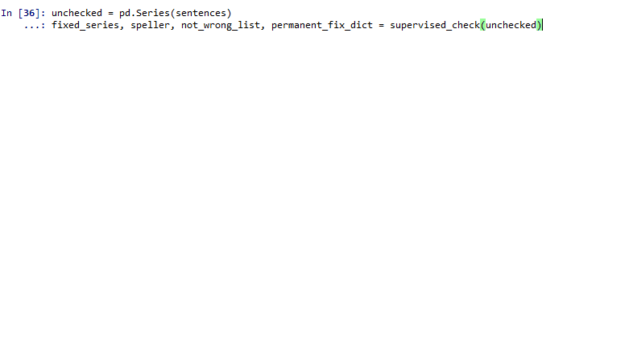

# supervised-spellcheck
Supervised spellchecking module, [pyspellchecker](https://github.com/barrust/pyspellchecker) wrapper designed for survey responses in particular, where spelling errors are common and can interfere with downstream applications such as topic modelling, vector space embedding and visualizations. 

#### Basic Usage

Start with a list of sentences that you want to check for misspellings. 

```python
from spell_check import *
from pandas import Series

sentences = ["Bill thinks Marvel comics are acceptible but hates the moviess",
            "Jade lieks reading romance novles in her pajamas"]
```

**supervised_check** is the primary function to search for misspellings. By default it accepts pandas Series objects.

```python
unchecked = Series(sentences)
fixed_series, speller, not_wrong_list, permanent_fix_dict = supervised_check(unchecked)
```

**supervised_check** will loop through your Series and prompt you for a command for each misspelling it finds. At each prompt, the interface offers its top suggestion for a correction (based on Levenshtein Distance. See [pyspellchecker](https://github.com/barrust/pyspellchecker) package for more details). You can enter the following input at each prompt:

​    **y**		  --> replace misspelled word with suggestion
​    **ya**		--> replace all occurrences of misspelled word with suggestion
​    **n**     	 --> do not replace word (ie, skip to next)
​    **na**    	--> do not replace word and add current spelling to dictionary. Future instances will not count as mispelled
​    **o**    	   --> replace misspelled word, but not with suggested correction. This option will ask you enter a custom spelling, followed by a 'y' or 'ya' to specify replacement type
​    **del**   	 --> delete this response from the output Series
​    **ex**    	 --> exit the function loop

Upon completing the **supervised_check** loop, the function will return 4 objects:

​	**fixed_series**			  --> pandas Series with spelling corrected as instructed 
​	**speller**						--> SpellChecker object
​	**not_wrong_list**		 --> List of words where 'na' was inputted. SpellChecker isn't perfect, some words it thinks are misspelled are actually correct. Any words indicated as such will be stored in this list.
​	**permanent_fix_dict** --> Dict of words where 'ya' was inputted. Here the *keys* are the mispelled words, and the *values* their correct spelling.


Below is a gif of the function looping through the example above. Note that 'pajamas' is an acceptable spelling(yet SpellChecker thinks it's wrong), and the top suggestion for the misspelling 'lieks' is incorrect and requires an alternate spelling correction.  

<h1 align="left">
  
</h1>
